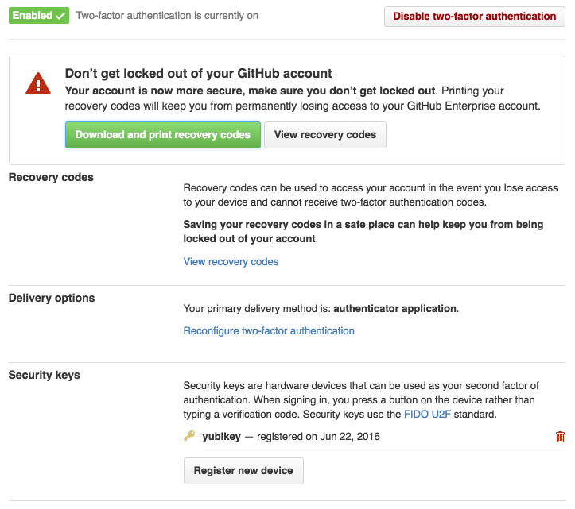
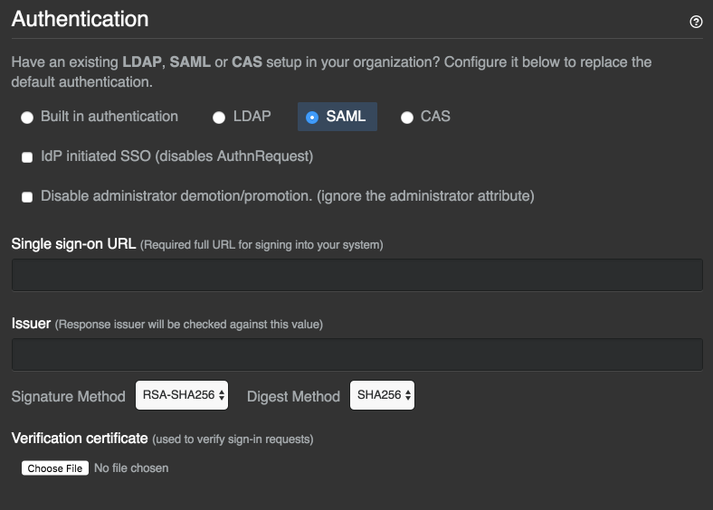
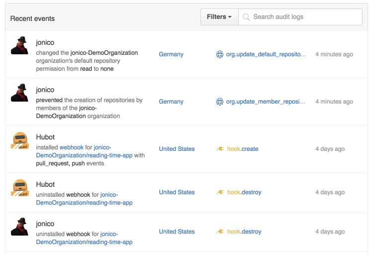
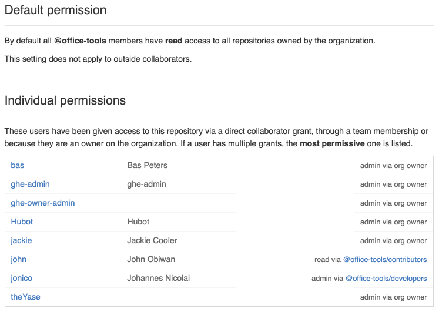
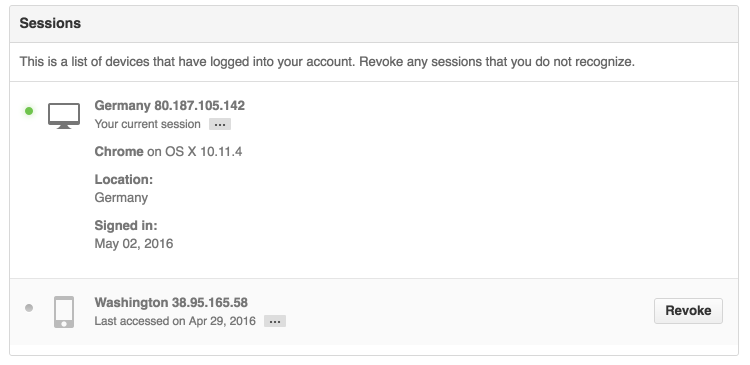
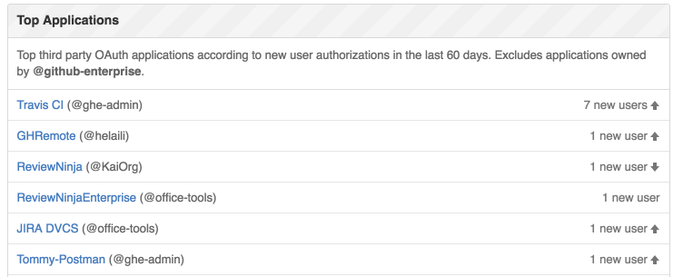
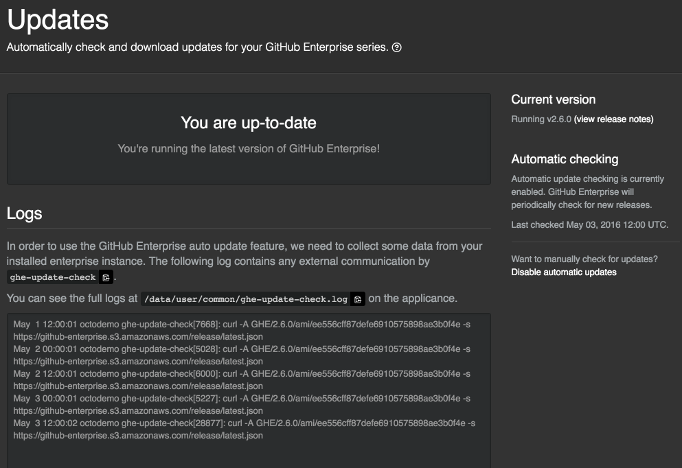
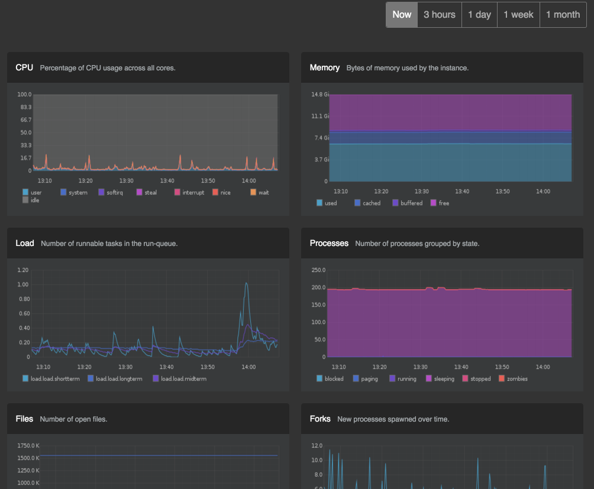
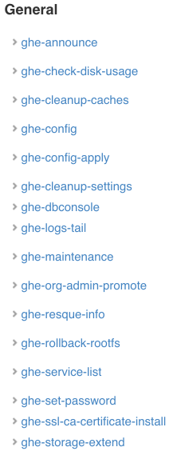

## How secure is our solution

GitHub is taking security very seriously as it protects the assets of more than 70000 companies and the majority of all Open Source projects.

It has [recently been classified](https://pokeinthe.io/2016/04/15/state-of-security-alexa-one-top-million-2016-04/) with a security A+ rating by the Mozilla Observatory which only applied to .003% of the top 1 million sites.

GitHub probably employs more people dedicated to security as all competitors combined.

As GitHub Enterprise uses the same code base as GitHub.com, it benefits from the same experienced gained by successfully securing the source code of more than 14 million users -[ even if under massive attacks](http://fortune.com/2015/04/03/github-ddos-china/).

GitHub Enterprise security features in a nutshell are shown on [https://enterprise.github.com/security](https://enterprise.github.com/security)

GitHub Security best practices are shown in this [blog post](https://github.com/blog/2077-github-enterprise-security-best-practices).

Last but not least, GitHub is running a large [**Bug Bounty program**](https://bounty.github.com/), rewarding anybody finding security vulnerabilities.

Some highlights (not common at most of our competitors):

* Branch permissions on team and individual level

* Read, Write, Admin permissions on Repository and Organization level

* GPG commit and tag signature verification: [https://help.github.com/categories/gpg/](https://help.github.com/categories/gpg/)

* 2 factor authentication including hardware security keys (FIDO U2F)

* SAML, LDAP, CAS authentication working out of the box

* Security patches for entire appliance managed by GitHub, no need to manually patch any components of the appliance

* Audit log fully searchable including geography from where actions were performed

* Out of the box audits on public keys

* See which users have not turned on 2 factor authentication yet

* Intuitive UI showing access for every individual user to every repository and over which concept (team, org membership, default permission) access was granted and how to remove it

* Self guided tours built into GitHub Enterprise to teach new users about security mechanisms

* Disable force pushes on instance, org or repo level

* Detailed reports where a user’s account was used on which device

* Detailed reports which external applications have accessed GitHub’s APIs

* Ability to revoke access for individual applications or users

## How easy and how far does GitHub Enterprise scale?

GitHub Enterprise benefits from the experience of scaling GitHub.com as it runs on the same code base. It has been highly optimized for thousands of multiple user web UI interactions and Git clone and push operations.

Git operations have been heavily optimized by processing Git operations in the same process that received the operation (as opposed to spawning git helper processes in the background as many other solutions are doing). Our engineering team has shared its experience on how they optimized GitHub Enterprise for performance in [this blog post](http://githubengineering.com/benchmarking-github-enterprise/) where the following diagrams have been taken from.

A single instance with default settings scales very well to at least 5000 users (as long as CI is integrated using web hooks and an [appropriate](https://help.github.com/enterprise/2.7/admin/guides/installation/installing-github-enterprise-on-aws/#hardware) machine is used). 

GitHub Enterprise supports [clustering](https://help.github.com/enterprise/2.7/admin/guides/clustering/) for any of its services (Git, Web interface, pages, search) if any scaling issues with more than 5000 users should arise. Clustering can be added when it is actually needed (no need to plan for a cluster upfront).

## How cheap will it be to implement GitHub Enterprise?

## How cheap will it be to operate and maintain GitHub Enterprise - upgrade, patches, provisioning and so on?

GitHub Enterprise can be 

* installed in literally 20 minutes

* updates can complete within literally 3 minutes

* high availability setup, incremental, zero-downtime backup, monitoring and log forwarding are working out of the box (no professional services engagements needed)

This is all realized by shipping GitHub Enterprise in a virtual appliance that can be hosted on public clouds (AWS, Azure) and on many hypervisors (VMWare, OpenStack KVM, Hyper-V, XenServer) in a private data center.

By having a single approach of how to deliver GitHub Enterprise,  updates, security patches, backups, monitoring are guaranteed to work out of the box without any "it-depends on your environment" documentation.

This is a huge contrast to most competitors that have dozens of approaches how to ship their software which leads to an explosion of configuration permutations (three different supported OSes with two major versions each, three different data bases, three install topologies leads to 3 x 2 x 3 x 3 = 54 different combinations) that are impossible to support equally.

Scaling, clustering, HA setup, updates are often only vaguely described and contain many manual steps whereas it is fully automated in GitHub Enterprise.

All administration related tasks are accessible over the [web based administration console](https://help.github.com/enterprise/2.7/admin/guides/installation/web-based-management-console/) as well as over dedicated GitHub Enterprise [support commands](https://help.github.com/enterprise/2.7/admin/articles/command-line-utilities/) in the [ssh console](https://help.github.com/enterprise/2.7/admin/guides/installation/administrative-shell-ssh-access/).

More info under [https://help.github.com/enterprise/2.7/admin/guides/installation/](https://help.github.com/enterprise/2.7/admin/guides/installation/)

Should any help be needed, our support folks are all "real software engineers", often contributing to the infrastructure and application development on GitHub.com. They will do their very best to make sure you have the same contact in support from the moment you entered a ticket to case resolution to have a consistent experience.

## Export and import commands

Documentation: [https://help.github.com/enterprise/2.7/admin/guides/migrations/](https://help.github.com/enterprise/2.7/admin/guides/migrations/)

Blog post: [https://github.com/blog/2171-migrate-your-repositories-using-ghe-migrator](https://github.com/blog/2171-migrate-your-repositories-using-ghe-migrator)

Tested commands (have to run on virtual appliance)

# Exporting

export USERNAME=<user with permissions to export and import>

export GITHUB_TOKEN=<personal access token with repo and admin:org permissions>

# ... add all repositories to export

ghe-migrator add <repo url> -u $USERNAME -p $GITHUB_TOKEN

# ...

export EXPORT_UID=<displayed migration uid>

ghe-migrator export -g $EXPORT_UID -u $USERNAME -p $GITHUB_TOKEN

# Importing

export MIGRATION_ARCHIVE=<path to displayed migration archive>

ghe-migrator prepare $MIGRATION_ARCHIVE

export IMPORT_UID=<displayed migration uid>

# ... run as often as there are still conflicts to resolve

ghe-migrator conflicts -g $IMPORT_UID > conflicts.csv

ghe-migrator map -i conflicts.csv -g $IMPORT_UID

# ...

ghe-migrator import $MIGRATION_ARCHIVE -u $USERNAME -p $GITHUB_TOKEN -g $IMPORT_UID

ghe-migrator audit -g $IMPORT_UID

ghe-migrator unlock -g $IMPORT_UID -u $USERNAME -p $GITHUB_TOKEN

